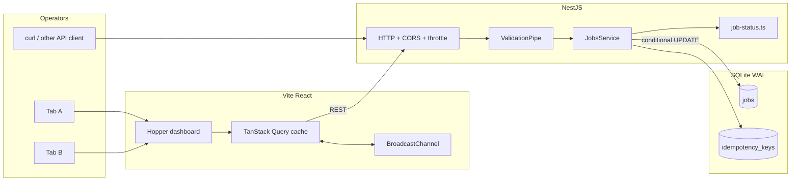
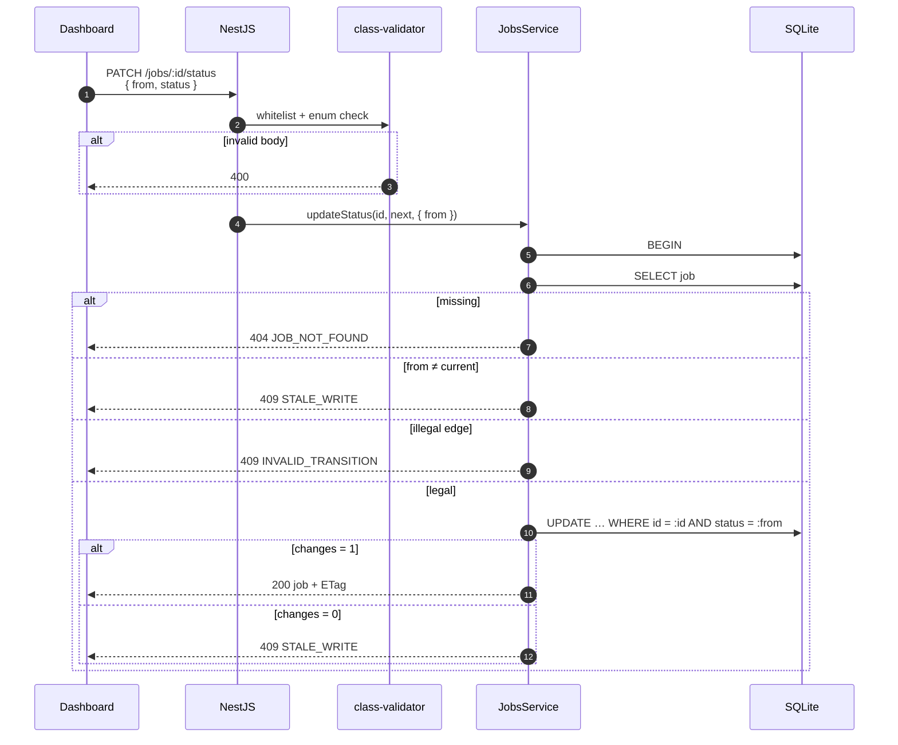
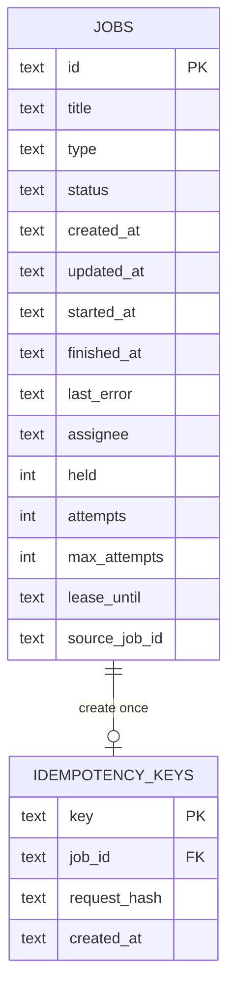

# Hopper

**A small job queue with a hard rule:** a ticket can only move along a legal graph, and two operators cannot both claim the same waiting job.

<p align="center">
  
  
  
</p>

| | |
| --- | --- |
| **Live app** | [hopper-web-rust.vercel.app](https://hopper-web-rust.vercel.app) |
| **Live API** | [hopper-api-ijex.onrender.com](https://hopper-api-ijex.onrender.com) |
| **Health** | [hopper-api-ijex.onrender.com/health](https://hopper-api-ijex.onrender.com/health) |
| **Repository** | [github.com/shubhangini67/hopper](https://github.com/shubhangini67/hopper) |

Hopper is a React dashboard in front of a NestJS API. The board is the operator surface. The interesting part is the write path: **React never has to be trusted.**

```
pending  →  running  →  completed
   \            ↘
    ↘            failed
     failed
```

Completed and failed are terminal. They cannot become running again — not from the board, and not from `curl`.

---

## High-level architecture

One browser, one API process, one SQLite file. That is the whole production shape. No worker pool, no message broker, no distributed lock service.



**What each layer is allowed to do**

| Layer | Responsibility | What it is not |
| --- | --- | --- |
| Dashboard | Show counts, suggest the next legal button, handle loading / 409 | The source of truth |
| NestJS | Validate input, enforce the graph, serialize claims | A background worker |
| SQLite | Persist rows; make `WHERE status = :from` the lock | A queue product |

Two tabs share a `BroadcastChannel` so a local mutation refetches the other tab. That is comfort. The lock is still the SQL `WHERE` clause.

---

## Low-level system architecture

### Request path



### Compare-and-set (the bonus)

The client must send the status it last saw (`from`) plus the status it wants (`status`). The write is:

```sql
UPDATE jobs
SET status = :next, updated_at = :now, …
WHERE id = :id AND status = :from;
```

If two tabs both saw `pending` and both send `{ "from": "pending", "status": "running" }`:

1. The first `UPDATE` matches one row. That job is now `running`.
2. The second `UPDATE` matches zero rows. The API re-reads the job and returns **409 `STALE_WRITE`** with the current record.

A hidden button is not a security boundary. Bypassing the dashboard still hits DTO validation, the transition map, and this `WHERE` clause.

Create also sends an `Idempotency-Key` so a double-click does not insert two jobs.

### Status machine

Encoded once in `backend/src/jobs/job-status.ts`. React may hide illegal buttons. This module is the rulebook.

| From | Allowed next |
| --- | --- |
| `pending` | `running`, `failed` |
| `running` | `completed`, `failed` |
| `completed` | — |
| `failed` | — |

### Persistence model



SQLite runs in WAL mode with a 5s busy timeout. One Node process, one file. The conditional `UPDATE` is portable to Postgres later without changing the API.

### Extra operator tools (not the bonus)

On top of the CAS write:

- **15-minute lease** on in-flight work. Heartbeat extends it. `POST /jobs/reap` fails expired leases with `from: running`.
- **Hold / release** so Claim next skips parked waiters.
- **Retry budget** — three failures, then dead-letter; requeue is refused.

The assignment bonus is still the atomic claim.

### Concurrency answers

| Question | Answer in this repo |
| --- | --- |
| Where is the graph enforced? | `JobsService` + `job-status.ts` — not React |
| What if someone calls the API directly? | `class-validator` → 400. Illegal graph → 409 `INVALID_TRANSITION`. Stale `from` → 409 `STALE_WRITE` |
| What if two requests arrive at almost the same time? | SQLite serializes writers. `WHERE status = :from` is the lock. One winner, one 409 |
| How do we avoid an inconsistent state? | There is no “set status = running” without matching the expected current status. Terminal jobs have an empty transition list |

Optional `If-Match` (ETag) is a second, HTTP-native check. The dashboard does not require it; `from` is enough.

---

## Stack

| Side | Choice | Why |
| --- | --- | --- |
| Frontend | React 19, Vite, TypeScript, TanStack Query, dnd-kit | One screen: board + list + inspector |
| Backend | NestJS 11, class-validator, Throttler | DTOs and a global exception filter |
| Database | better-sqlite3, WAL | No Docker for local review; same SQL on Postgres |

---

## HTTP API

| Method | Path | Notes |
| --- | --- | --- |
| `GET` | `/` | Index so a submitted API URL is not an empty 404 |
| `GET` | `/health` | Process + `SELECT 1` |
| `POST` | `/jobs` | Always enters as `pending`. Optional `Idempotency-Key` |
| `GET` | `/jobs` | Query `status`, `type`, `q`. Body: `data`, `counts`, `pulse` |
| `GET` | `/jobs/pulse` | Stale leases, holds, claimable waiters, dead letters |
| `POST` | `/jobs/claim` | Oldest waiting job that is **not on hold**. Same CAS write |
| `POST` | `/jobs/reap` | Fail every in-flight job whose lease expired |
| `GET` | `/jobs/:id` | One job + `ETag` |
| `POST` | `/jobs/:id/hold` | Park a waiter |
| `POST` | `/jobs/:id/release` | Put it back in line |
| `POST` | `/jobs/:id/heartbeat` | Extend the lease 15 minutes |
| `POST` | `/jobs/:id/requeue` | New pending copy of a terminal job |
| `PATCH` | `/jobs/:id/status` | `{ from, status }`. Atomic transition |
| `DELETE` | `/jobs/:id` | 204 |

Errors use a compact [RFC 7807](https://www.rfc-editor.org/rfc/rfc7807) shape (`application/problem+json`).

```json
{
  "status": 409,
  "code": "STALE_WRITE",
  "detail": "Another request already changed this job. Refresh and try the next legal step.",
  "currentStatus": "running",
  "requestedStatus": "running",
  "job": { "id": "...", "status": "running" }
}
```

### Race from a terminal

```bash
ID=<uuid>
curl -s -o /tmp/a.json -w "%{http_code}\n" -X PATCH "$API/jobs/$ID/status" \
  -H 'content-type: application/json' \
  -d '{"from":"pending","status":"running"}' &
curl -s -o /tmp/b.json -w "%{http_code}\n" -X PATCH "$API/jobs/$ID/status" \
  -H 'content-type: application/json' \
  -d '{"from":"pending","status":"running"}' &
wait
```

Expect one `200` and one `409`. The e2e suite does the same with `Promise.all`.

---

## Dashboard

One screen on purpose. Operators need counts, a board, and a list — not five routes.

- Status counts (Waiting / In flight / Finished / Failed)
- Board + list, type filter, search
- Create, start, complete, fail with a reason, delete
- **Claim next** — oldest waiting job that is not on hold
- Hold / release, lease + heartbeat, reap stale, retry budget
- Pulse + Needs attention
- Inspector, CSV export, drag onto a legal column
- Loading skeletons, API error retry, 409 conflict modal
- `N` new job, `/` search, `C` claim next, `Esc` close

React only *suggests* the next buttons. The server still rejects cheats.

---

## Local run

Node 18+.

```bash
git clone https://github.com/shubhangini67/hopper.git
cd hopper
npm run install:all
```

```bash
npm run dev:api    # http://127.0.0.1:3000
npm run dev:web    # http://127.0.0.1:5173
```

SQLite file: `backend/data/hopper.sqlite`. An empty database is seeded with 10 demo jobs.

```bash
npm test           # state machine + CAS write
npm run test:e2e   # validation, lifecycle, concurrent PATCH
```

---

## Deploy

| Piece | Host | Root | Live |
| --- | --- | --- | --- |
| App | Vercel | `frontend/` | [hopper-web-rust.vercel.app](https://hopper-web-rust.vercel.app) |
| API | Render | `backend/` | [hopper-api-ijex.onrender.com](https://hopper-api-ijex.onrender.com) |

**App env (build-time)**

```
VITE_API_URL=https://hopper-api-ijex.onrender.com
```

**API env**

```
NODE_ENV=production
NODE_VERSION=22
DATABASE_PATH=/opt/render/project/src/data/hopper.sqlite
FRONTEND_ORIGIN=https://hopper-web-rust.vercel.app
```

CORS allows `localhost` / `127.0.0.1:5173` plus `FRONTEND_ORIGIN`. Request headers include `Idempotency-Key` and `X-Hopper-Operator`.

Free SQLite on a disposable disk resets on deploys. For a durable demo, attach a persistent disk or swap the driver for Postgres. The transition SQL does not change.

---

## Assumptions and trade-offs

- One process, one SQLite file. That matches the assignment.
- Operators are humans (or curl). Nothing claims jobs in the background.
- Hard deletes exist because the spec has `DELETE /jobs/:id`.
- Rate limit is 120 requests / minute / IP. Health and `/` are excluded.
- Demo seed data is intentional so a reviewer is not staring at an empty board.

With more time: Postgres + migrations, auth, a real worker that *pulls* `pending` jobs through the same CAS write, soft deletes, Playwright for the two-tab UI, and a shared types package so the React transition map cannot drift from Nest.

```
backend/    NestJS API, SQLite, unit + e2e tests
frontend/   React dashboard
```
